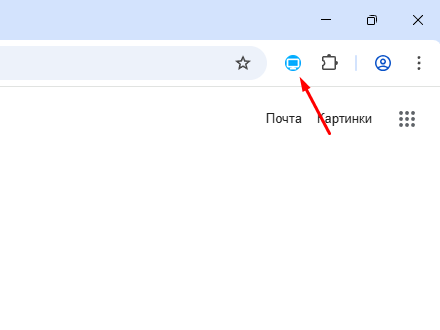
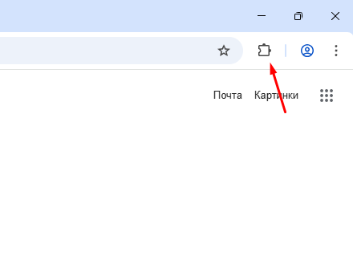
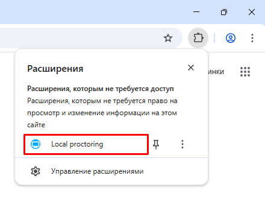
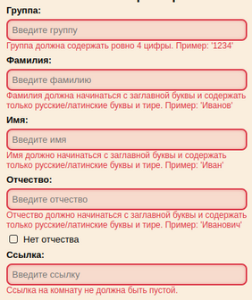
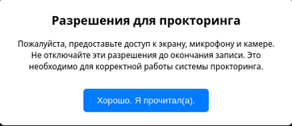
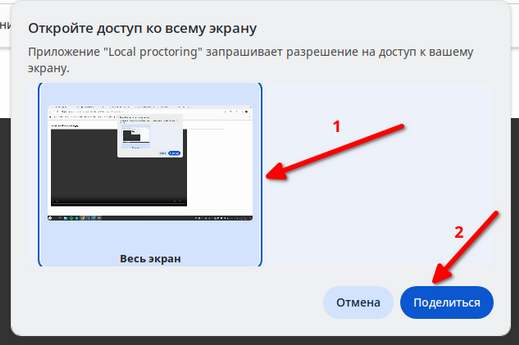
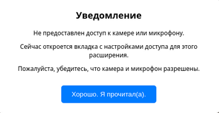
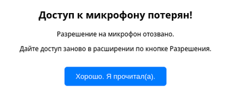
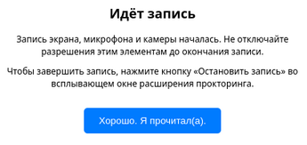

# Локальный прокторинг
## Расширение предназначено для работы с браузером Google Chrome. Требуемая версия браузера Google Chrome 134 и выше.
Узнать свою версию бразуера Google Chrome можно по адресу `chrome://version`, где после слов Google Chrome указаны четыре числа и первое из них и является нужным для сравнения.

## Замечания:
- В версиях 1.2.* выбирайте только основной экран для работы и браузера в случае, когда вы имеете больше одного монитора.

- В версии 1.2.1 наблюдается проблема с очисткой логов, поэтому файл на последующей записи может быть больше.

- Данная инструкция является ознакомительной и не избавляет пользователя от обязанности внимательно читать уведомления на экране. Текст уведомлений может иметь немного отличий от представленного на изображениях ниже.

# Инструкция по использованию системы локального прокторинга

## Подготовка папки расширения

1. Скачайте zip архив расширения. Имя архива будет `client_v1.2.1.zip` или при более новых версиях меняется комбинация чисел после v. Чтобы получить последнюю версию расширения, Вам нужно перейти на страницу релизов по ссылке https://github.com/moevm/mse1h2025-prctr/releases/latest и скачать архив с названием `client_v*.*.*.zip`, где вместо * стоят числа версии. Прямая ссылка на скачивание архива расширения версии 1.2.1 https://github.com/moevm/mse1h2025-prctr/releases/download/v1.2.1/client_v1.2.1.zip.

2. Распакуйте архив расширения. Архиваторы работают по-разному. Если при распаковке Вы получили папку `client`, то это папка с расширением. Если вы получили папку с названием как у архива, то папка `client` находится внутри.

## Установка расширения в Google Chrome

1. Откройте раздел "Управление расширениями" в браузере.

    

2. Активируйте режим разработчика.

    

3. Нажмите "Load unpacked" (Загрузить распакованное расширение) и выберите папку расширения `client`.

    


4. Для удобства закрепите расширение на панели инструментов.

    


## Работа с клиентской частью расширения
### 1. Открытие popup-расширения

1. Если ранее расширение было закреплено на панели инструментов браузера (правый верхний угол, рядом со строкой адреса), то для открытия интерфейса popup-расширения нажмите на значок расширения.

    

2. Иначе, нажмите на значок "Пазл" на панели инструментов браузера (правый верхний угол, рядом со строкой адреса).

    

3. В открывшемся окне нажмите по области рядом с иконкой/названием расширения, чтобы открыть интерфейс popup-расширения.

    

### 2. Интерфейс popup-расширения


- Поля:
 - Группа
 - Фамилия
 - Имя
 - Отчество
 - Ссылка на экзаменационную "комнату".
- Чекбокс для пользователей без Отчества
- Информация о текущих статусах разрешений (✓ – предоставлено, ✗ – не предоставлено):
  - Микрофон
  - Камера
  - Экран
- Дата начала последней записи
- Время записи
- Кнопки:
  - Разрешения – запрашивает доступ к необходимым разрешениям
  - Начать запись – начинает записи
  - Остановить запись – заканчивает записи, сохраняя их у пользователя локально

### 3. Заполнение данных

В форме необходимо указать:
- **Группа**: ровно 4 цифры (например, `1234`).
- **Фамилия, Имя, Отчество**: должны начинаться с заглавной буквы и содержать только русские/латинские буквы и тире (например, `Иванов` или `Albus-Severus`). 
- **Ссылка на экзаменационную "комнату"**: поле не должно быть пустым.

    

Примечания:
- Система автоматически проверяет корректность ввода и предоставляет подсказки при ошибках.
    - Ошибки:
    
        
    
    - Подсказки:
    
        


### 4. Настройка разрешений
1. Нажмите кнопку **"Разрешения"**, которая находится во всплывающем окне, для перехода в системную вкладку расширения. Система уведомляет о необходимости предоставления разрешений, а также просит не прерывать их для корректной работы приложения.

    

    Чтобы открыть всплывающее окно, нужно нажать на закреплённый значок нашего расширения в панеле инструментов.

    

    Если вы не закрепили его, то нужно нажать значок расширений браузера в панеле инструментов и там нажать по расширению Local proctoring, однако рекомендуется в таком случае вернуться на шаг закрепления расширения в панеле инструментов.

       

2. Нажав на кнопку "Хорошо. Я прочитал(а).", система предложит выдать разрешение на запись экрана:

    

    ### Прерывание записи
    При отмене предоставления доступа к экрану система сообщит, об отмене разрешения для экрана:

    

    Повторно нажмите **"Разрешения"**.

3. После предоставления экрана система попросит выдать разрешение на использование микрофона и камеры. 
- "Разрешить в этот раз". Расширение будет запрашивать у Вас разрешение каждый раз при записи. 
- "Разрешить при нахождении на сайте". Вы соглашаетесь с тем, что расширение всегда использует либо микрофон, либо камеру. 
 
    


    ### Прерывание записи

    При запрете разрешений на использование микрофона и камеры система сообщит, что доступ к микрофону или камере запрещен:

     

 

    После чего система попросит убедиться, что доступ к микрофону и камере разрешены.

    

    Нажав на кнопку "Хорошо. Я прочитал(а)."), система закроет системную вкладку расширения и перенаправит Вас на вкладку настроек безопасности расширения. Для камеры и микрофона необходимо поменять статус "Блокировать" на "Разрешить" или "Спрашивать (по умолчанию)". 

    

    Примечание:
    - В случае со статусом "Спрашивать (по умолчанию)" расширение будет запрашивать у Вас разрешение каждый раз при записи.

    Повторно нажмите **"Разрешения"**.

4. После выдачи всех разрешений система сообщит о готовности к записи с небольшой информацией о работе расширения.

    
    
    Также на вкладке появится предпросмотр: экрана и камеры.

    ### Прерывание записи
    Если закрыть доступ к экрану, камере или микрофону после предоставления разрешений, то система уведомит о том, что соответствующее разрешение было заблокировано и нужно повторно нажать кнопку "Разрешения" после предоставления недостающих разрешений.

    
    
    

### 5. Начало записи

1. Нажмите кнопку **"Начать запись"**. Система:
- Запустит запись.
- Отключит предпросмотр.
- Уведомит о начале процесса.

    


2. Во время записи можно можно включить и выключить предпросмотр через системную вкладку.
 
    
    


    ### Прерывание записи

    При отзыве разрешений во время записи:
    1. Система уведомит о блокировке доступа попросит выдать разрешения и начать запись заново.
    2. Нажмите **"Хорошо. Я согласен(а)."** для остановки записи.
    3. Файлы сохранятся в папку **Загрузки (Downloads)**. Система предоставит статистику:
    - Начало записи
    - Конец записи
    - Длительность записи
    - Куда сохранены файлы записи экрана и камеры
    - Название файла записи экрана (его размер)
    - Название файла записи камеры (его размер):
    - Куда сохранен файл логов

        

#### Конец записи
1. Нажмите "Остановить запись".
2. Записи остановятся и сохранятся в папку **Загрузки (Downloads)**.
3. Система предоставит статистику:
- Начало записи
- Конец записи
- Длительность записи
- Куда сохранены файлы записи экрана и камеры
- Название файла записи экрана (его размер)
- Название файла записи камеры (его размер):
- Куда сохранен файл логов

## Сервер расширения
### CLI
Для запуска сервера в папке server ввести следующую команду:
```bash
docker-compose up --build || docker compose up --build
```

### GUI
При вводе адреса `http://localhost:5000/` открывается страница с пятью окнами ввода: “Группа”, “Фамилия”, “Имя”, “Отчество”, “Дата” – для фильтрации, и кнопкой “Поиск” для вывода записей в базе данных по заданному фильтру (по умолчанию показываются все записи). Поля участвуют в поиске по принципу “И”, и если поля пустые, то выводится вся база данных. База данных работает в UTC0 серверном формате. Метаданные прокторинга в формате локального для пользователя времени. Логирование осуществляется в UTC0 клиентском формате, вместе с этим в логировании есть поле с часовым поясом клиента.

Вывод записей базы данных происходит на странице `http://localhost:5000/results`. Страница работает только при переадресации с главной страницы поиска.

Также все результаты выводятся в неприведенном виде по адресе `http://localhost:5000/get_sessions`

## Просмотр записей

Кодеки: H264 - MPEG-4 AVC (part 10) (avc1) и OPUS
Видеоплеер должен работать с этими кодеками. Чтобы решить проблему отображения, искать решение на стороне видеоплеера. 

Full support:

- Linux: 

    1. Chrome
    2. Microsoft Edge
    3. Totem
    4. Haruna

- Windows:

    1. Chrome
    2. Microsoft Edge
    3. Vivaldi


Half support: 

- Linux:

    1. VLC (Смотреть локально "Кодеки->Декодирование с аппаратным ускорением" и пробовать другие, если по умолчанию не работает. На Fedora 41 работают VA-API, VA-API DRM, отключено, не работает VDPAU) Звук в левом наушнике.
    2. Firefox - нет длительности и не работает перемотка.
    3. Dragon Player - работает, но после перемотки накладывается инверсия на изображение.

- Windows:

    1. Кино и ТВ - работает перемотка только кнопками, нет длительности.
    2. Фотографии - работает перемотка только кнопками, длительность некорректная.
    3. Медиаплеер -  нет длительности и не работает перемотка.
    4. Firefox - нет длительности и не работает перемотка.
    5. VLC - работает с автоматическим модулем демультиплексора, при перемотке возможны искажения изображения на несколько секунд.
